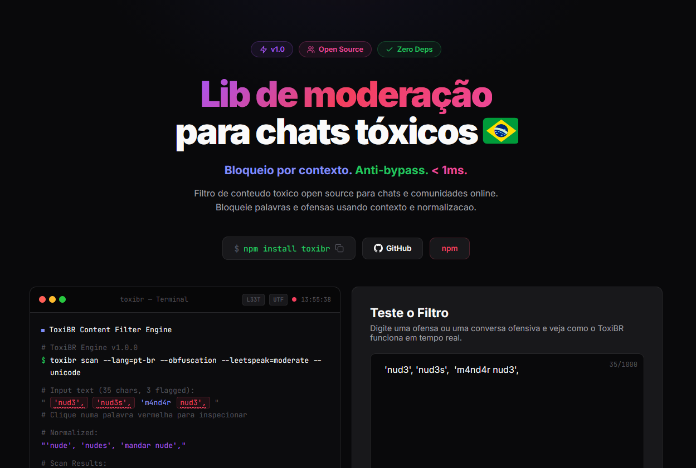

# ToxiBR - Moderação de Chat Open Source



[](https://www.npmjs.com/package/toxibr)
[](https://www.npmjs.com/package/toxibr)
[](LICENSE)
[](CONTRIBUTING.md)

Biblioteca open source de moderação de conteúdo tóxico para **português brasileiro**. Filtra mensagens em tempo real com detecção por contexto, anti-bypass e zero dependências.

> **Context-Aware. Anti-Bypass. < 1ms. Zero Deps.**

**[Teste ao vivo](https://toxibr.vercel.app)** · **[npm](https://www.npmjs.com/package/toxibr)** · **[Contribua](#contribuindo)**

---

## Sumário

- [Início rápido](#início-rápido)
- [Por que ToxiBR?](#por-que-toxibr)
- [Por que contexto importa](#por-que-contexto-importa)
- [Modo censor](#modo-censor)
- [Uso avançado](#uso-avançado)
- [Camadas de filtragem](#camadas-de-filtragem)
- [Normalização anti-bypass](#normalização-anti-bypass)
- [Context-aware: proximidade](#context-aware-proximidade)
- [Exportações](#exportações)
- [Contribuindo](#contribuindo)
- [Licença](#licença)

---

## Início rápido

```bash
npm install toxibr
```

```ts
import { filterContent } from 'toxibr';

const result = filterContent('mensagem aqui');

if (!result.allowed) {
  console.log(result.reason);  // 'hard_block' | 'directed_insult' | 'fuzzy_match' | ...
  console.log(result.matched); // palavra que matchou
}
```

---

## Por que ToxiBR?

A maioria dos filtros de chat usa wordlists simples — bloqueia "lixo" em qualquer contexto, gera falso positivo em frases inocentes, e não entende gírias brasileiras. ToxiBR resolve isso:

- **880+ termos e frases** — slurs, sexual, violência, racismo, nazismo, bullying, assédio
- **Context-aware** — entende a diferença entre "eu me sinto um lixo" (permitido) e "você é um lixo" (bloqueado)
- **Anti-bypass** — normaliza leetspeak, homoglyphs, acentos, zero-width chars, abreviações BR
- **Zero dependências** — nada de SDK pesado, roda em qualquer lugar
- **< 1ms por mensagem** — feito para chat em tempo real
- **Fuzzy matching** — Levenshtein pega typos intencionais (viadro, bucetra)
- **Prefix matching** — pega palavras truncadas (estup -> estupro, punh -> punheta)
- **Seed word density** — detecta conteúdo sexual codificado (3+ palavras suspeitas juntas)
- **Proximity detection** — analisa distância entre pronomes e palavras ofensivas
- **Modo censor** — substitui palavras tóxicas por `***` em vez de bloquear

---

## Por que contexto importa

| Frase | Filtro tradicional | ToxiBR |
|---|---|---|
| "Esse filme é incrível!" | FLAGGED | ALLOWED — sentimento positivo |
| "Aquele boss fight é insano!" | FLAGGED | ALLOWED — contexto de gaming |
| "Me sinto um lixo" | FLAGGED | ALLOWED — auto-expressão |
| "Você é um lixo" | FLAGGED | BLOCKED — insulto dirigido |

---

## Modo censor

```ts
import { censorContent } from 'toxibr';

const result = censorContent('seu arrombado vai se fuder');
console.log(result.censored); // "seu ********* vai se *****"
console.log(result.matches); // [{ word: 'arrombado', reason: 'hard_block', ... }]
```

### Censurar telefones e links inline

```ts
import { createCensor } from 'toxibr';

const censor = createCensor({
  censorPhones: true, // "me liga 21994709426" -> "me liga ***********"
  censorLinks: true,  // "veja www.site.com"  -> "veja ************"
  censorChar: '#',    // caractere customizado
});

const result = censor('me liga 21994709426 seu idiota');
// { censored: "me liga *********** seu ******", ... }
```

---

## Uso avançado

```ts
import { createFilter } from 'toxibr';

const filter = createFilter({
  extraBlockedWords: ['minha-palavra-custom'],
  extraContextWords: ['outra-palavra'],
  blockLinks: true,      // default: true
  blockPhones: true,     // default: true
  blockDigitsOnly: true, // default: true
  blockEmojis: true,     // default: true
});

const result = filter('mensagem aqui');
```

---

## Camadas de filtragem

| Camada | O que faz | Exemplo |
|---|---|---|
| **Censorship bypass** | Bloqueia `*` e `#` entre letras | `p*ta`, `v#ado` |
| **Pré-normalização** | Pega d4, Xcm, -18 antes do leetspeak | `20cm`, `d4`, `-18` |
| **Links** | URLs e domínios | `https://...`, `site.com` |
| **Telefone** | Números BR (5+ dígitos) | `(21) 99470-9426` |
| **Emojis** | Emojis ofensivos e sequências | `🖕`, `🍆💦` |
| **Hard-block** | 880+ termos sempre proibidos | Slurs, sexual, violência, nazismo |
| **Fuzzy match** | Levenshtein para typos | `viadro` -> `viado` (dist 1) |
| **Prefix match** | Palavras truncadas | `estup` -> `estupro` |
| **Context-aware** | Insulto dirigido vs. auto-expressão | `"seu lixo"` vs. `"me sinto um lixo"` |
| **Seed density** | 3+ palavras sexuais juntas | `"pau veiudo saco lotado leite"` |

---

## Normalização anti-bypass

Antes de checar a wordlist, o texto passa por 11 etapas de normalização:

| Técnica | Antes | Depois |
|---|---|---|
| Zero-width chars | `vi​ado` | `viado` |
| Homoglyphs cirílicos | `viаdо` | `viado` |
| Acentos | `viàdo` | `viado` |
| Chars repetidos | `viiaaado` | `viado` |
| Leetspeak | `3stupr0` | `estupro` |
| Censura | `p*ta`, `v#ado` | bloqueado |
| Pontos/traços | `p.u.t.a` | `puta` |
| Espaços isolados | `p u t a` | `puta` |
| Abreviações BR | `ppk`, `krl` | `pepeca`, `caralho` |

---

## Context-aware: proximidade

O filtro usa **detecção por proximidade** — analisa se o padrão dirigido (você, seu, tu) está perto da palavra ofensiva numa janela de 5 palavras:

```ts
filterContent('eu me sinto um lixo');    // { allowed: true }  — auto-expressão
filterContent('voce e um lixo');         // { allowed: false } — insulto dirigido
filterContent('me sinto um lixo e voce e um lixo tambem'); // { allowed: false }
filterContent('me sinto um lixo, queria que voce me respeitasse'); // { allowed: true }
```

---

## Exportações

```ts
import {
  filterContent,             // filtro default (zero config)
  createFilter,              // cria filtro customizado
  censorContent,             // censor default (zero config)
  createCensor,              // censor customizado
  normalize,                 // normaliza texto (útil para debug)
  HARD_BLOCKED,              // 880+ termos hard-blocked
  CONTEXT_SENSITIVE,         // termos context-sensitive
  SEXUAL_SEED_WORDS,         // palavras-semente sexuais
  DIRECTED_PATTERNS,         // regex de fala dirigida
  SELF_EXPRESSION_PATTERNS,  // regex de auto-expressão
  ABBREVIATION_MAP,          // mapa de abreviações BR
} from 'toxibr';
```

---

## Contribuindo

**ToxiBR é feito pela comunidade.** Se você fala português brasileiro, sua contribuição faz diferença real — cada palavra adicionada protege milhares de usuários.

### Como contribuir

1. **Fork** o repositório
2. Crie uma branch (`git checkout -b feat/nova-palavra`)
3. Adicione os termos em `src/wordlists.ts` e testes em `__tests__/filter.test.ts`
4. Rode os testes: `npm test`
5. Abra um **Pull Request**

### Formas de ajudar

- Adicionar palavras/frases que faltam na wordlist
- Reportar falsos positivos (palavras que não deveriam ser bloqueadas)
- Melhorar a detecção de contexto
- Adicionar testes para novos cenários
- Melhorar a documentação

Leia o guia completo: **[CONTRIBUTING.md](CONTRIBUTING.md)**

Encontrou um falso positivo ou uma palavra que deveria ser bloqueada? Use o formulário no site: **[toxibr.vercel.app](https://toxibr.vercel.app)**

```bash
npm test          # roda os testes
npm run validate  # verifica duplicatas nas wordlists
```

---

## Licença

MIT
